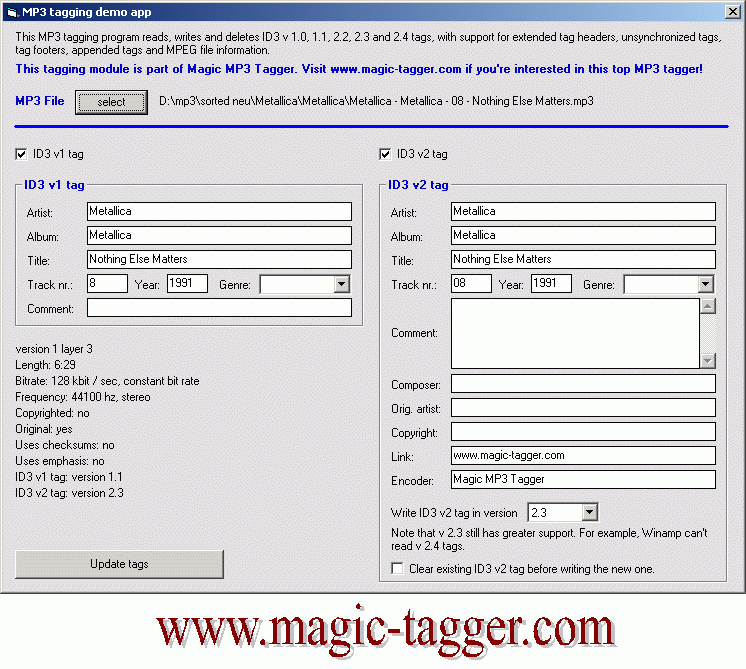



## A reference MP3 tagging module \(reads, writes and deletes every ID3 tag version from 1\.0 to 2\.4\)

### Description

This MP3 tagging module reads, writes and deletes ID3 v 1.0, 1.1, 2.2, 2.3 and 2.4 tags, with support for extended tag headers, unsynchronized tags, tag footers, appended tags and even MPEG file information! A little demo application is also included, where you can edit the tags of any MP3 file on your disk like in WinAMP. Notice: this module is a part of Magic MP3 Tagger. Visit www.magic-tagger.com if you're interested in this top MP3 tagger!
 
### More Info
 

             |
---                |---
**Submitted On**   |2005-11-01 17:40:16
**By**             |[Mathias Kunter](https://github.com/Planet-Source-Code/PSCIndex/blob/master/ByAuthor/mathias-kunter.md)
**Level**          |Advanced
**User Rating**    |5.0 (80 globes from 16 users)
**Compatibility**  |VB 6\.0
**Category**       |[Sound/MP3](https://github.com/Planet-Source-Code/PSCIndex/blob/master/ByCategory/sound-mp3__1-45.md)
**World**          |[Visual Basic](https://github.com/Planet-Source-Code/PSCIndex/blob/master/ByWorld/visual-basic.md)
**Archive File**   |[A\_referenc1946141142005\.zip](https://github.com/Planet-Source-Code/mathias-kunter-a-reference-mp3-tagging-module-reads-writes-and-deletes-every-id3-tag-versi__1-63163/archive/master.zip)

